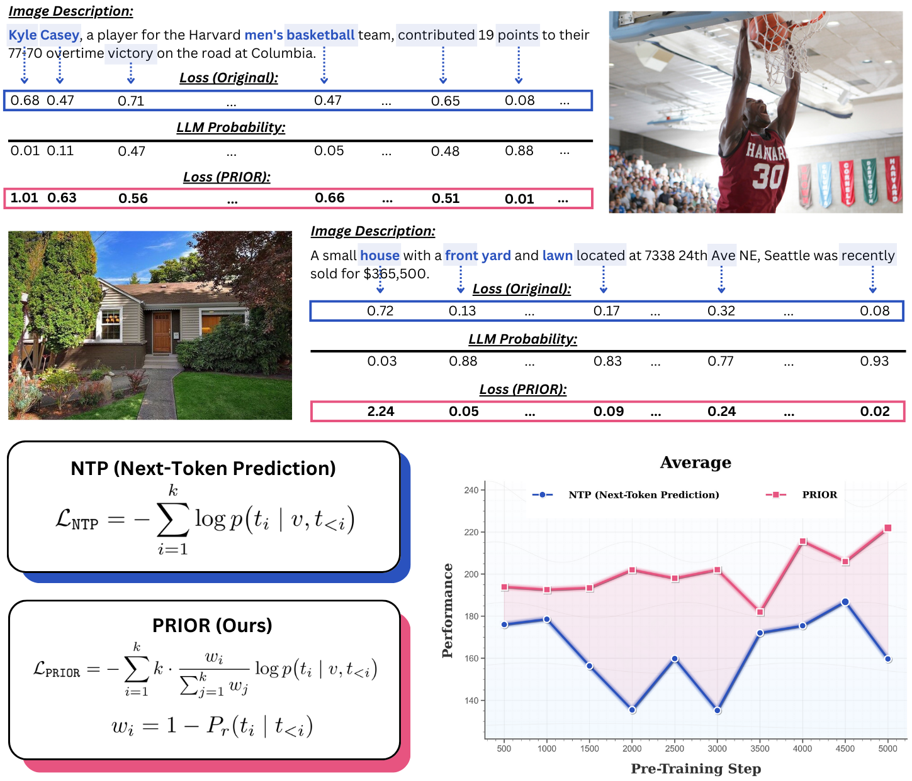

<h1 align="center"> Prioritizing Image-Related Tokens Enhances <br> Vision-Language Pre-Training </h1>

<p align="center">
<a href="https://arxiv.org/abs/2505.08971">📃 Paper</a>



We present **PRIOR**, a simple algorithm that enhances vision-language pre-training approach by prioritizing
image-related tokens through differential weighting in the NTP loss, drawing from the importance sampling framework.


## TODO Roadmap

[ ] **Release the pre-training code for U-LVLMs**

[ ]  **Release the pre-training code for H-LVLMs**


✅ **Paper on arxiv** <a href="https://arxiv.org/abs/2505.08971">📃 Paper</a>


## Citation
If you use or extend our work, please consider citing our paper.
```bibtex
@article{chen2025prior,
  title={Prioritizing Image-Related Tokens Enhances Vision-Language Pre-Training},
  author={Chen, Yangyi and Peng, Hao and Zhang, Tong and Ji, Heng},
  journal={arXiv preprint arXiv:2505.08971},
  year={2025}
}
```
